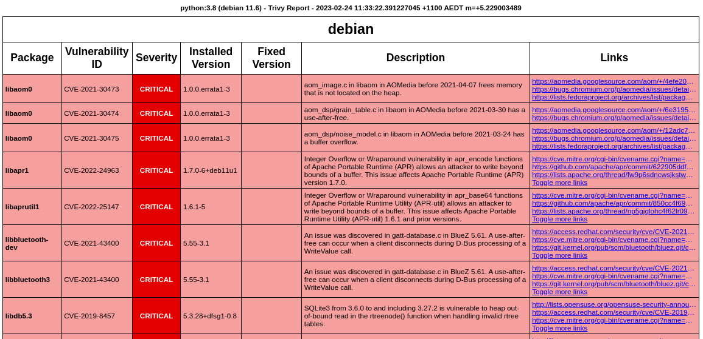

# trivy-plugin-teamcity-report

A Trivy plugin that exports an html report in a format used for teamcity, and outputs teamcity messages
### Installation

```shell
# Ensure the address starts with github, not https:// as this will fail
trivy plugin install github.com/cfculhane/trivy-plugin-teamcity-report
```

### Usage: 

```shell
trivy teamcity-report OPERATION TARGET OUTPUTFILE [TRIVYPARAMS]
```
### Examples: 
- `trivy teamcity-report image python:3.8 output.html --scanners vuln`
- `trivy teamcity-report fs /path/to/dir output.html --scanners vuln,config`

### Outputs

This plugin emits an HTML report that is modified from the one [supplied by trivy](https://github.com/aquasecurity/trivy/blob/main/contrib/html.tpl), with the following modifications:

- Sorted vulnerabilities from Critical -> Unknown
- Added description field
- Truncated links list to 300px with `...`
- Smaller font size

Example below:



It also emits build statics that can then be read into teamcity, e.g.

```shell
##teamcity[buildStatisticValue key='VULNERABLITY_COUNT_UNKNOWN' value='1']
##teamcity[buildStatisticValue key='VULNERABLITY_COUNT_LOW' value='587']
##teamcity[buildStatisticValue key='VULNERABLITY_COUNT_MEDIUM' value='279']
##teamcity[buildStatisticValue key='VULNERABLITY_COUNT_HIGH' value='212']
##teamcity[buildStatisticValue key='VULNERABLITY_COUNT_CRITICAL' value='14']
```
